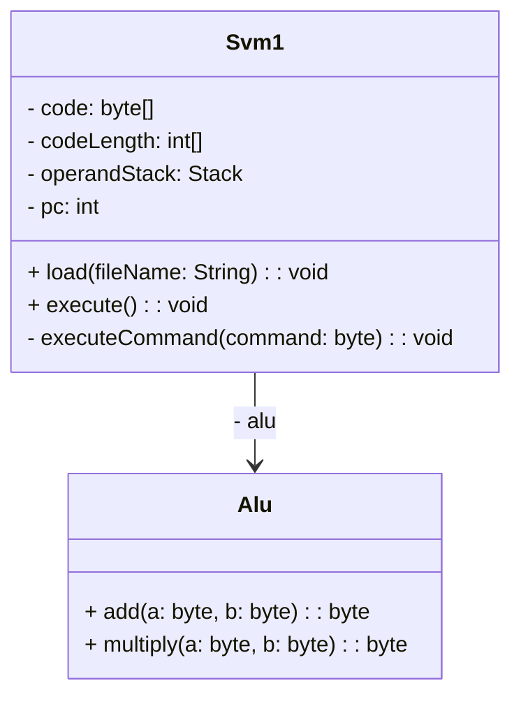
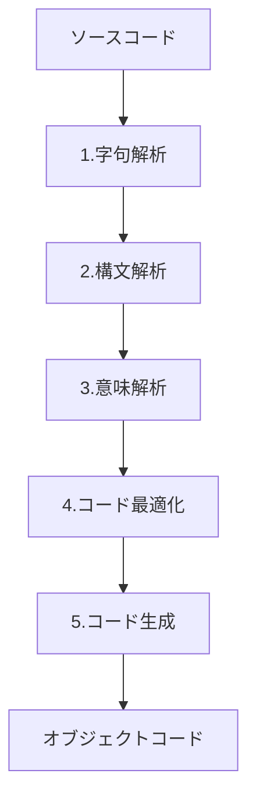

# simple-compiler
@ITにあった[簡単なコンパイラを作る記事](https://atmarkit.itmedia.co.jp/ait/articles/0612/02/news016.html)をやってみる

# Build & Execution
Build
```bash
$ make build REL_PATH=simple_calculator CLASS_NAME=Main
```

Execution
```bash
$ make exec REL_PACKAGE=simple_calculator CLASS_NAME=Main ARGS=code0.svm
```

# Class Diagram


# 簡単な四則演算の計算を実現できる程度のプログラミング言語のBNF
```
<program> ::= main '{' <expression> '}'    // "main {"ではじまり"}"で終わる
<expression> ::= <term>{ <opeas> <term> }  // 式
<term> ::= <factor>{ <opemd> <factor> }    // 
<factor> ::= <number>|( <expression> )     // 要素
<number> ::= <digit>{<digit>}
<opeas> ::= + | -
<opemd> ::= * | /
<digit> ::= 0|1|2|3|4|5|6|7|8|9
```

# コンパイラの基本構成
