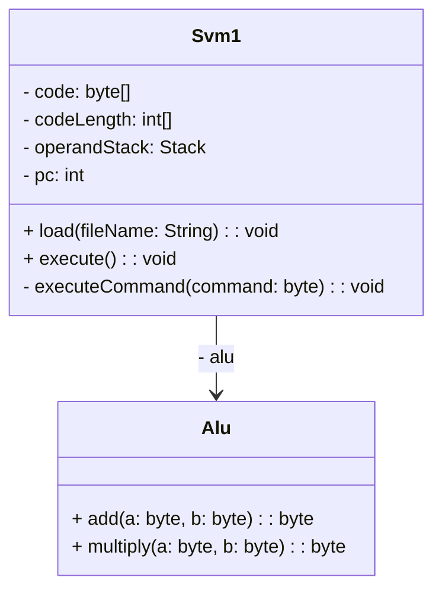

# simple-compiler
@ITにあった[簡単なコンパイラを作る記事](https://atmarkit.itmedia.co.jp/ait/articles/0612/02/news016.html)をやってみる

# Build & Execution
Build
```bash
$ make build CLASS_NAME=Main
```

Execution
```bash
$ make exec CLASS_NAME=Main ARGS=code0.svm
```

# Class Diagram

